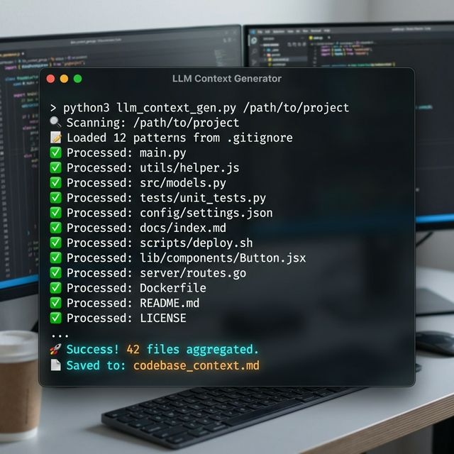

# Codebase Context: Kod_cikarici
> Generated at: 2026-04-07 14:43:08

---

## File: `README.md`

```md
# 🚀 LLM Context Generator



[](https://github.com/hasanhuseyinyetkiner/codextractor/actions/workflows/ci.yml)
[](https://opensource.org/licenses/MIT)

> **"Stop copying and pasting file by file."**
> A zero-dependency, high-performance CLI tool that packs your entire codebase into a single, LLM-friendly Markdown file. Optimized for ChatGPT, Claude, and Gemini.

---

## ✨ Features

- 📦 **Zero Dependencies**: Uses only Python standard libraries. Scales anywhere.
- 🔍 **Intelligent Filtering**: Automatically skips binaries, lock files, and common noise (`node_modules`, `.git`, `venv`).
- 📝 **.gitignore Support**: Respects your existing `.gitignore` patterns.
- 🎯 **Extension Filtering**: Only include what you need (e.g., just `.py` and `.js`, or one grouped selection like `@content`).
- 🤖 **LLM Optimized**: Outputs structured Markdown with relative path headers and code blocks.

---

## 🚀 Quick Start

### Basic Usage
Pack the current directory into `llm_context.md`:
```bash
python3 llm_context.py
```

### Advanced Usage
Pack a specific project, filtered by extensions, with verbose logging:
```bash
python3 llm_context.py /path/to/project -o codebase.md -e @content -v
```

`@content` bundles the requested text-based extensions into a single selection:
`.yml`, `.md`, `.sample`, `.sh`, `.json`, `.mmd`, `.txt`, `.cpp`, `.html`, `.idx`, `.js`, `.pack`, `.template`, `.xml`.

> Note: `.pdf` is still skipped by the current text-only reader. If you want PDF extraction too, we can add a dedicated parser in a follow-up.

---

## 🏗️ Architecture Decisions & Trade-offs

In a world full of "bloated" tools, this project takes a different path. Here are the core engineering decisions made:

### 1. Minimalistic Design vs. External Libraries
- **Decision**: Avoided using libraries like `pathspec` for `.gitignore` parsing.
- **Trade-off**: While `pathspec` is more compliant with Git's complex globbing, it requires a `pip install`. This tool chooses **portability**. We implemented a robust `fnmatch` based approach that covers 95% of use cases while remaining a single-file, zero-dependency script.

### 2. Functional Programming vs. OOP
- **Decision**: The logic is kept in focused functions rather than complex classes.
- **Rationale**: For a script of this size, OOP often adds unnecessary boilerplate. A functional approach makes the execution flow explicit and easier for other developers (and LLMs) to audit and extend.

### 3. UTF-8 Resilience
- **Decision**: Uses `errors='ignore'` during the final read phase after a `1024-byte` text-validation check.
- **Rationale**: Real-world projects often contain accidental non-UTF-8 characters in comments or documentation. We prioritize **completeness** over crashing on encoding errors.

---

## 🛠️ Installation

Simply download `llm_context.py` and you're ready to go. No `pip install` required.

```bash
curl -O https://raw.githubusercontent.com/hasanhuseyinyetkiner/codextractor/main/llm_context.py
```

---

## ⚖️ License

Distributed under the MIT License. See `LICENSE` for more information.

---
*Developed by [Hasan Yetkiner](https://github.com/hasanhuseyinyetkiner)*
```

---

## File: `llm_context.py`

```py
#!/usr/bin/env python3
import os
import argparse
import fnmatch
from pathlib import Path
from datetime import datetime

# Default ignored directories
DEFAULT_IGNORE_DIRS = {
    'node_modules', '.git', '.venv', 'venv', 'env', '__pycache__',
    'dist', 'build', '.idea', '.vscode', 'coverage', '.claude', '.serena'
}

# Default ignored extensions
DEFAULT_IGNORE_EXTS = {
    '.pdf', '.exe', '.dll', '.so', '.dylib', '.png', '.jpg', '.jpeg',
    '.gif', '.zip', '.tar', '.gz', '.lock', '.pyc', '.ico', '.svg'
}

# Named extension groups for one-step selection
EXTENSION_GROUPS = {
    'content': {
        '.yml', '.md', '.sample', '.sh', '.json', '.mmd', '.txt',
        '.cpp', '.html', '.idx', '.js', '.pack', '.template', '.xml'
    }
}

def normalize_allowed_exts(requested_exts: list = None) -> set | None:
    """Normalizes raw extensions and expands any named extension groups."""
    if not requested_exts:
        return None

    normalized_exts = set()
    for ext in requested_exts:
        cleaned_ext = ext.strip().lower()
        if not cleaned_ext:
            continue

        if cleaned_ext.startswith('@'):
            group_name = cleaned_ext[1:]
            if group_name in EXTENSION_GROUPS:
                normalized_exts.update(EXTENSION_GROUPS[group_name])
                continue

        if not cleaned_ext.startswith('.'):
            cleaned_ext = f'.{cleaned_ext}'

        normalized_exts.add(cleaned_ext)

    return normalized_exts or None

def load_gitignore_patterns(target_dir: Path):
    """Loads patterns from .gitignore if it exists."""
    patterns = []
    gitignore_path = target_dir / '.gitignore'
    if gitignore_path.exists():
        with open(gitignore_path, 'r', encoding='utf-8') as f:
            for line in f:
                line = line.strip()
                if line and not line.startswith('#'):
                    patterns.append(line)
    return patterns

def should_ignore(path: Path, target_path: Path, gitignore_patterns: list, verbose: bool) -> bool:
    """Checks if a path should be ignored based on defaults and .gitignore."""
    rel_path = path.relative_to(target_path)

    # Check default ignored dirs
    if any(part in DEFAULT_IGNORE_DIRS for part in rel_path.parts):
        return True

    # Check extension
    if path.suffix.lower() in DEFAULT_IGNORE_EXTS:
        return True

    # Check .gitignore patterns
    for pattern in gitignore_patterns:
        # Simple glob matching
        if fnmatch.fnmatch(str(rel_path), pattern) or fnmatch.fnmatch(path.name, pattern):
            if verbose:
                print(f"  [Ignored by .gitignore]: {rel_path}")
            return True

    return False

def is_text_file(filepath: Path) -> bool:
    """Checks if a file is readable as UTF-8 text."""
    try:
        with open(filepath, 'r', encoding='utf-8') as f:
            f.read(1024)
        return True
    except (UnicodeDecodeError, PermissionError):
        return False

def generate_context(target_dir: str, output_file: str, allowed_exts: list = None, verbose: bool = False):
    """Aggregates codebase into a single Markdown file for LLM context."""
    target_path = Path(target_dir).resolve()
    out_path = Path(output_file).resolve()
    normalized_allowed_exts = normalize_allowed_exts(allowed_exts)

    if not target_path.is_dir():
        print(f"❌ Error: '{target_path}' is not a valid directory.")
        return

    print(f"🔍 Scanning: {target_path}")
    gitignore_patterns = load_gitignore_patterns(target_path)
    if gitignore_patterns:
        print(f"📝 Loaded {len(gitignore_patterns)} patterns from .gitignore")

    processed_count = 0

    with open(out_path, 'w', encoding='utf-8') as out:
        out.write(f"# Codebase Context: {target_path.name}\n")
        out.write(f"> Generated at: {datetime.now().strftime('%Y-%m-%d %H:%M:%S')}\n\n")
        out.write("---\n\n")

        for root, dirs, files in os.walk(target_path):
            # In-place modification of dirs to skip ignored ones
            dirs[:] = [d for d in dirs if d not in DEFAULT_IGNORE_DIRS and not d.startswith('.')]

            for file in files:
                filepath = Path(root) / file

                if should_ignore(filepath, target_path, gitignore_patterns, verbose):
                    continue

                if normalized_allowed_exts and filepath.suffix.lower() not in normalized_allowed_exts:
                    continue

                if is_text_file(filepath):
                    relative_path = filepath.relative_to(target_path)

                    if str(relative_path) == str(out_path.relative_to(target_path)):
                        continue # Don't include the output file itself

                    ext = filepath.suffix.lstrip('.') or 'text'
                    out.write(f"## File: `{relative_path}`\n\n")
                    out.write(f"```{ext}\n")

                    try:
                        with open(filepath, 'r', encoding='utf-8', errors='ignore') as f:
                            out.write(f.read().strip() + "\n")
                        out.write("```\n\n---\n\n")
                        processed_count += 1
                        if verbose:
                            print(f"✅ Processed: {relative_path}")
                    except Exception as e:
                        print(f"⚠️  Error reading {relative_path}: {e}")

    print(f"\n🚀 Success! {processed_count} files aggregated.")
    print(f"📄 Saved to: {out_path}")

if __name__ == "__main__":
    parser = argparse.ArgumentParser(description="Pack your project into a single Markdown for ChatGPT/Claude.")
    parser.add_argument("dir", nargs="?", default=".", help="Target directory (default: current)")
    parser.add_argument("-o", "--output", default="llm_context.md", help="Output filename (default: llm_context.md)")
    parser.add_argument("-e", "--ext", nargs="+", help="Filter by extensions or groups (e.g. -e .py .js @content)")
    parser.add_argument("-v", "--verbose", action="store_true", help="Show detailed processing logs")

    args = parser.parse_args()
    generate_context(args.dir, args.output, args.ext, args.verbose)
```

---

## File: `LICENSE`

```text
MIT License

Copyright (c) 2024

Permission is hereby granted, free of charge, to any person obtaining a copy
of this software and associated documentation files (the "Software"), to deal
in the Software without restriction, including without limitation the rights
to use, copy, modify, merge, publish, distribute, sublicense, and/or sell
copies of the Software, and to permit persons to whom the Software is
furnished to do so, subject to the following conditions:

The above copyright notice and this permission notice shall be included in all
copies or substantial portions of the Software.

THE SOFTWARE IS PROVIDED "AS IS", WITHOUT WARRANTY OF ANY KIND, EXPRESS OR
IMPLIED, INCLUDING BUT NOT LIMITED TO THE WARRANTIES OF MERCHANTABILITY,
FITNESS FOR A PARTICULAR PURPOSE AND NONINFRINGEMENT. IN NO EVENT SHALL THE
AUTHORS OR COPYRIGHT HOLDERS BE LIABLE FOR ANY CLAIM, DAMAGES OR OTHER
LIABILITY, WHETHER IN AN ACTION OF CONTRACT, TORT OR OTHERWISE, ARISING FROM,
OUT OF OR IN CONNECTION WITH THE SOFTWARE OR THE USE OR OTHER DEALINGS IN THE
SOFTWARE.
```

---

## File: `.gitignore`

```text
__pycache__/
*.py[cod]
*$py.class
.claude/
.serena/
.vscode/
venv/
.env
```

---

